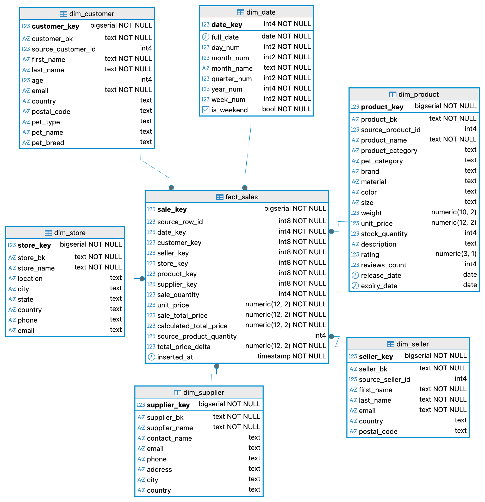

# BigDataSnowflake

Лабораторная работа №1 по Big Data: загрузка исходных CSV в PostgreSQL и преобразование данных в аналитическую модель `звезда`.


## Запуск

```bash
docker compose up -d
docker compose exec postgres sh -c "cd /workspace && psql -U postgres -d lab1 -f import_csv.sql"
docker compose exec postgres sh -c "cd /workspace && psql -U postgres -d lab1 -f ddl.sql"
docker compose exec postgres sh -c "cd /workspace && psql -U postgres -d lab1 -f dml.sql"
```

## Результат


